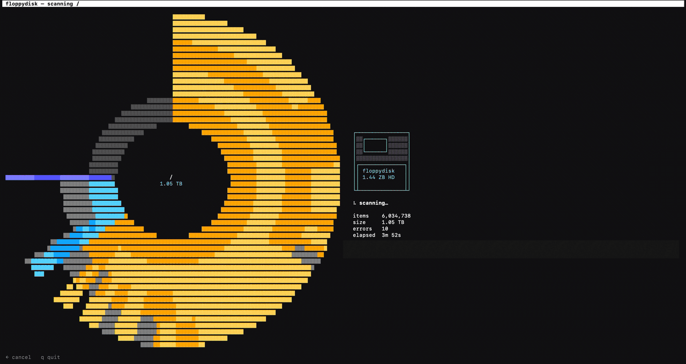

# floppydisk

```
╔═╗╦  ╔═╗╔═╗╔═╗╦ ╦╔╦╗╦╔═╗╦╔═
╠╣ ║  ║ ║╠═╝╠═╝╚╦╝ ║║║╚═╗╠╩╗
╚  ╩═╝╚═╝╩  ╩   ╩ ═╩╝╩╚═╝╩ ╩
```

A [DaisyDisk](https://daisydiskapp.com/)-style storage scanner and cleaner
that lives entirely in your terminal, drawn in ASCII/Unicode. Pure Python,
standard library only — no dependencies.



💬 Questions? [Chat with this repo](https://githubchat.spacehendrix.com/#url=https%3A%2F%2Fgithub.com%2Fspacehendrix%2Ffloppydisk%2Ftree%2Fmain)

## What it does

Same concept as DaisyDisk:

- **Volume picker** — lists mounted volumes with used/free bars, or scan
  your home, the current folder, or any path you type.
- **Live scan** — a background thread walks the tree while the sunburst
  map builds on screen in real time.
- **Interactive sunburst map** — the center is the current folder, the
  inner ring its direct children, outer rings their contents. Arc length
  is proportional to size; hues follow a rainbow around the wheel; the
  selection is highlighted as a textured slice. Free space and pooled
  small files show in grey.
- **Drill down** — open a folder and the map re-centers on it; go back up
  with backspace.
- **Collector** — mark files and folders with `c` (like dragging to
  DaisyDisk's collector), review the bin with `C`, then `x` moves
  everything to the Trash (recoverable — nothing is permanently deleted).
- **Reveal in Finder** with `o`.

## Install

With Homebrew (recommended):

```sh
brew install spacehendrix/tap/floppydisk
floppydisk
```

Or from a clone, with no install at all — it's pure standard library:

```sh
python3 -m floppydisk            # volume picker
python3 -m floppydisk ~/Movies   # scan a folder directly
```

Or as a pip package:

```sh
pipx install .    # or: pip install .
floppydisk
```

## Keys

| key | action |
| --- | --- |
| `↑`/`↓`, `j`/`k` | select item |
| `⏎`, `→`, `l` | open folder |
| `⌫`, `←`, `h` | go up (top level → volume picker) |
| `g` / `G` | first / last item |
| `c` | collect item for deletion (again to uncollect) |
| `C` | open the collector bin |
| `x` | empty collector → move to Trash |
| `s` | sort by size / name |
| `r` | rescan |
| `o` | reveal selection in Finder |
| `?` | help |
| `q` | quit |

## Notes

- Sizes are **on-disk** (allocated blocks, like DaisyDisk), in decimal
  units like Finder. Hardlinked files are counted once.
- Deleting only ever moves items to the Trash (via Finder when possible,
  otherwise `~/.Trash` / the volume's `.Trashes`). System paths, mount
  points, and anything under `/System` are refused outright.
- Scanning a full startup disk needs **Full Disk Access** for your
  terminal app (System Settings → Privacy & Security), otherwise
  protected folders are skipped and counted as errors. When scanning
  `/`, other mounted volumes and the APFS system-volume mountpoints are
  skipped so nothing is double-counted through firmlinks.
- Wants a 256-color terminal (any modern one) and looks best ≥ 100
  columns; below 76 columns the map hides and you get the list only.
